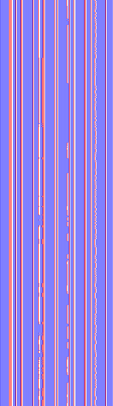

# cart-pole-em
Goal: train a continuous EM to control cart pole, then to control car racing 2d

  

# CEM Formulation

## Formulation of Emergent Models

**1) Encoding / Initialization.** We initialize with $S_0$ and $E(x)$.

$$
\tilde{S}_0 = S_0 \oplus E(x)
$$

If $\oplus$ is a sum:

$$
\tilde{S}_0 = S_0 + E(x).
$$

**2) Evolution.** The system evolves by repeatedly applying $f$ until halting.

$$
\tilde{S}_{t+1}=f\!\big(\tilde{S}_t\big), \qquad t=0,1,2,\ldots,T
$$

$$
T=\min\{\,t\in\mathbb{N}\mid H(\tilde{S}_t)=1\,\}.
$$

**3) Decoding.** The output is

$$
y=D\!\big(\tilde{S}_T\big).
$$

## Results from training EM in cart pole environment
### Video

  

### Program rollout

  

## Continous Emergent Model (CEM)

We model this as an ODE relating the time derivative of the state to the transformed state $f(s)$, where $f$ is the transition function. States are $n$-dimensional real vectors:

$$
S \in \mathbb{R}^n \quad \text{where} \quad n \in \mathbb{N}.
$$

For input $x$ and initial state $S_0$, the state at $t=0$ is

$$
\tilde{S}(0) = S_0 \oplus E(x),
$$

and the evolution is

$$
\frac{d\tilde{S}(t)}{dt} = f\!\big(\tilde{S}(t)\big), \qquad t \ge 0.
$$

The halting time is

$$
T(x,S_0) = \min \{\, t \ge 0 \mid H(\tilde{S}(t)) = 1 \,\},
$$

For simplicity, we don’t use halting but run a finite number of internal time steps [0,T] for each control step.

and the final output is

$$
y = \phi(S_0, x) = D\!\big(\tilde{S}(T(x,S_0))\big).
$$

# Training
## (μ + λ) Evolutionary Algorithm

We use a (μ + λ) EA (elitist strategy). Start with μ parents; generate λ offspring via variation; evaluate all; then set the next population to the best μ from the union of parents and offspring, so elites never get lost.

Initialization: draw initial population P₀ = {x₁,…,x_μ} ~ Init.

At generation t: create offspring O_t = {x′₁,…,x′_λ} from P_t via variation V; evaluate f(·) on all x ∈ P_t ∪ O_t.

Selection (elitist): P_{t+1} = Top_μ(P_t ∪ O_t; f).

Stop on a budget or halting criterion (max evals, target fitness, etc.).

# Cartpole Results

--> SUCCESS

## Cartpole control
Bars show the output of the state S of the CEM after T unroll steps for each environment step

  

## Internal State 

Unrolled internal state of CEM, each frame is one environment step

  

